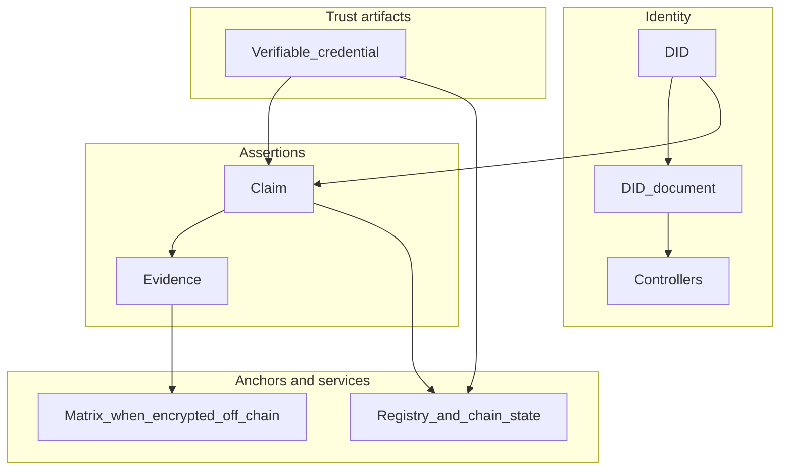

This page ties together concepts that are also described on the [Emerging digital identifiers](/platforms/Emerging/digital-identifiers) and [credential issuance](/platforms/Emerging/credential-issuance) platform pages. Read it when you need **one mental model** before diving into APIs or SDKs.

<Info>
  Standards background: IXO aligns with W3C work on decentralized identifiers and verifiable credentials. See [Decentralized Identifiers (DIDs) v1.0](https://www.w3.org/TR/did-core/) and the [Verifiable Credentials Data Model](https://www.w3.org/TR/vc-data-model/). On-chain and interchain specifics use the **`did:ixo:`** namespace and protocol modules documented under [IXO Protocol](/protocols/ixo-protocol).
</Info>

## Definitions

<AccordionGroup>
  <Accordion title="Decentralized Identifier (DID)" icon="fingerprint">
    A stable, resolvable identifier for an entity (for example `did:ixo:…`). It names a subject in the graph without requiring a single centralized account system.
  </Accordion>

  <Accordion title="DID document" icon="file-lines">
    Metadata bound to a DID: verification methods, **controllers**, services, and links used for authentication and discovery.
  </Accordion>

  <Accordion title="Controller" icon="user-shield">
    The party (human, org, or automated process) authorized to update the DID document or act for that identifier, within the rules of the protocol and domain.
  </Accordion>

  <Accordion title="Subject" icon="bullseye">
    The entity a statement is **about**. In a verifiable credential, the **credential subject** is identified by a DID (often the holder's DID).
  </Accordion>

  <Accordion title="Claim" icon="file-signature">
    A structured assertion about reality—typically about a domain or entity—that can be evaluated, disputed, or accepted against a protocol or rubric. Claims carry or reference **evidence**.
  </Accordion>

  <Accordion title="Verifiable credential (VC)" icon="id-card">
    A tamper-evident, issuer-signed bundle of claims about a subject, usable by **verifiers** without trusting only the holder's copy. Status and revocation may be checked against registry or service endpoints.
  </Accordion>

  <Accordion title="Issuer" icon="pen-nib">
    The party that signs and issues the VC after validation rules are satisfied.
  </Accordion>

  <Accordion title="Holder" icon="user">
    The party that presents the VC (often the subject).
  </Accordion>

  <Accordion title="Verifier" icon="clipboard-check">
    The party that checks signatures, issuer authority, schema, and status before trusting the content.
  </Accordion>
</AccordionGroup>

## Lifecycle (end-to-end)

1. **Register identity** — Create or obtain a DID and domain record so the entity exists in the shared model ([digital twins](/guides/digital-twins), [domain registration](/guides/domain-registration)).
2. **Submit a claim** — Assert something about that entity with evidence and context ([claims](/guides/dev/ixo-claims)).
3. **Validate / evaluate** — Humans, services, or Agentic Oracles check the claim against program rules; outcomes may be recorded on-chain or in linked services.
4. **Issue a VC** — After validation, an issuer may bind selected assertions into a verifiable credential whose **subject** is the holder's DID ([credential issuance](/platforms/Emerging/credential-issuance)).
5. **Verify or revoke** — Verifiers check proofs and status; issuers or governance may revoke or supersede credentials when state changes.

## How the pieces relate

- **Registry / chain** — Authoritative pointers and state for domains, claims lifecycle, and credential status, depending on deployment ([registry](/guides/registry), [IXO Protocol](/protocols/ixo-protocol)).
- **Matrix** — Optional encrypted rooms and events when evidence or payloads must not live on-chain ([IXO Matrix](/articles/ixo-matrix)).

## Implementation notes

- Use the [Authentication matrix](/reference/authentication-matrix) and [Networks and endpoints](/reference/networks-and-endpoints) so the correct credentials and base URLs match each **API surface** ([API introduction](/api-reference/intro-apis)).
- For TypeScript patterns (client setup, entities, claims), start with [Developer workflows](/guides/dev/workflows) and [Implementation examples](/guides/dev/examples).

## See also

<CardGroup cols={3}>
  <Card title="Core concepts" icon="lightbulb" href="/core-concepts">
    Vocabulary for domains, PODs, cooperation, and Qi.
  </Card>
  <Card title="Glossary" icon="book" href="/reference/glossary">
    Short definitions with links to deeper pages.
  </Card>
  <Card title="Authentication" icon="key" href="/guides/dev/authentication">
    Credentials and session patterns for developers.
  </Card>
</CardGroup>
