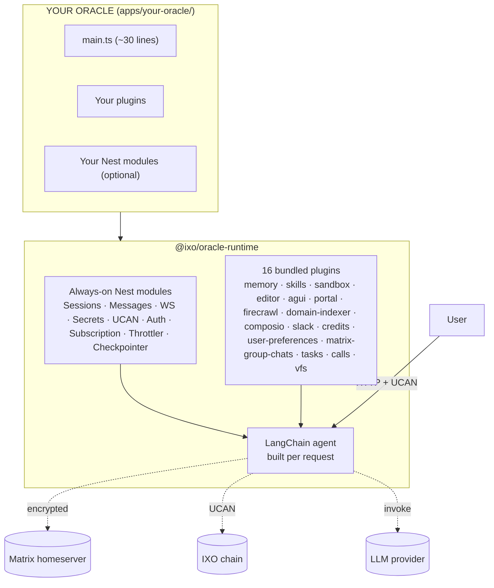
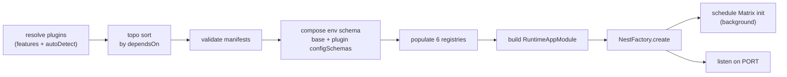

## The three layers

A QiForge deployment has exactly three layers. Knowing what each one owns saves a lot of confusion.



### Layer 1 — Your oracle

Typically `apps/your-oracle/src/main.ts` (a `createOracleApp(...)` call), a `config.ts` for identity, and any custom plugins or Nest modules.

**You own:** the entry point, your oracle's identity, custom plugins, custom Nest modules.

**You don't own:** the agent loop, the graph state shape, the checkpointer, the auth flow, the meta-tools, the bundled plugins' internals.

### Layer 2 — `@ixo/oracle-runtime`

The framework. Owns the bootstrap (`createOracleApp`), the always-on Nest modules (Sessions, Messages, WebSocket, Secrets, UCAN, Auth, Subscription, Throttler, Health), the per-request agent builder, the four always-on agent middleware (capability gate, tool validation, tool-repetition guard, tool retry — plus page-context and safety-guardrail when their hooks are set), the Matrix-backed SQLite checkpointer, and the plugin API.

You never edit this layer. Updates come via `pnpm update @ixo/oracle-runtime`.

### Layer 3 — Bundled plugins

16 plugins shipped inside the runtime package, each independently toggleable via `features`. See the [Plugin catalog](/build-an-oracle/reference/bundled-plugins/overview) for what each one does.

## Bootstrap, in one picture



The HTTP server accepts requests immediately; auth-requiring routes 401 until Matrix init finishes and the UCAN signing mnemonic loads.

Defined in [`create-oracle-app.ts`](https://github.com/ixoworld/ixo-oracles-boilerplate/blob/main/packages/oracle-runtime/src/bootstrap/create-oracle-app.ts).

## The six registries

Plugins don't talk to the runtime directly. They push contributions into one of six registries at boot; the agent builder reads from them per request.

| Registry | Holds | Collision rule |
| --- | --- | --- |
| ToolRegistry | All plugin tools | Flat namespace — collision is a boot error |
| SubAgentRegistry | All plugin sub-agents | Flat namespace — collision is a boot error |
| MiddlewareRegistry | All plugin middleware | Ordered topologically; no names |
| ManifestRegistry | All plugin manifests | Title collision = soft warn |
| ConfigSchemaRegistry | All plugin Zod schemas | Merged; later wins with warning |
| SharedStateRegistry | Plugin shared-state accessors | Flat namespace — collision is a boot error |

Source: [`packages/oracle-runtime/src/registries/`](https://github.com/ixoworld/ixo-oracles-boilerplate/blob/main/packages/oracle-runtime/src/registries/).

## What's pluggable vs fixed

| Pluggable | Fixed |
| --- | --- |
| Plugin set (bundled toggles + your plugins) | Agent loop (LangChain `createAgent`) |
| `nestModules` (your Nest modules) | Graph state shape (except one new `loadedPlugins` field) |
| `authExcludedRoutes` (host + plugin) | Checkpointer (Matrix-backed SQLite) |
| LLM provider (env-driven) | Auth flow (UCAN delegation) |
| `hooks.checkpointerForUser` (advanced) | The four always-on middleware |
| System prompt (via `OracleConfig.prompt`) | The Tier-1 block format |
| Anything inside a custom plugin | The six registries |

If you find yourself wanting to swap something on the "Fixed" side, you're probably trying to do something the framework explicitly doesn't allow — and you should either work within the model (e.g. write a plugin) or fork the runtime.

## Model resolution and hooks

How does the agent pick which LLM to call, and how do you change it?

**Provider is env-driven.** `LLM_PROVIDER` selects the whole per-role model map: `openrouter` (default) or `nebius`, each with its matching API key (`OPEN_ROUTER_API_KEY` / `NEBIUS_API_KEY`). The actual model id for each role (`main`, `subagent`, `utility`, `vision`, `guard`, …) is baked into the provider's model map — there is no env var to change a single role's model id on its own.

**Resolution is per-role.** Different jobs use different models. The main agent resolves the `main` role; sub-agents and utility calls resolve `subagent` / `utility` through `ctx.llm.get(role)`. The runtime resolves the main model as `resolveModel('main')`, defaulting to the provider map.

**To change the main agent's model, pass `hooks.resolveModel`** to `createOracleApp`. Spreading `params` keeps the provider's fallback models and latency sorting:

```ts
import { createOracleApp, getProviderChatModel } from '@ixo/oracle-runtime';

const app = await createOracleApp({
  config,
  plugins,
  hooks: {
    // role is 'main' | 'subagent' | 'utility'. Spreading params preserves
    // the provider's fallback models + latency sort.
    resolveModel: (role, params) =>
      getProviderChatModel(role, {
        ...params,
        ...(role === 'main' && { model: 'google/gemini-3.1-flash-lite' }),
      }),
  },
});
```

The runtime only calls `resolveModel('main')` itself, so a hook that special-cases `'main'` swaps **only the main agent's model**; sub-agents and utility calls keep the provider defaults unless your own code routes them through the hook too.

`resolveModel` is one of several `hooks` — the framework's advanced extension surface. Others include `checkpointerForUser` (swap the per-user checkpointer), `safetyModel` (enable the safety-guardrail middleware), `getRoomTitle` (enable the page-context middleware), and prompt-block overrides like `operationalMode`. See the [`createOracleApp` reference](/build-an-oracle/reference/createoracleapp) for the full list.

## Read next

<CardGroup cols={2}>
  <Card title="Request lifecycle" icon="timeline" href="/build-an-oracle/understand/request-lifecycle">
    What happens between user message and streamed response.
  </Card>
  <Card title="Build your first oracle" icon="play" href="/build-an-oracle/develop/create-oracle-app">
    The recipe for wiring `createOracleApp`.
  </Card>
</CardGroup>
