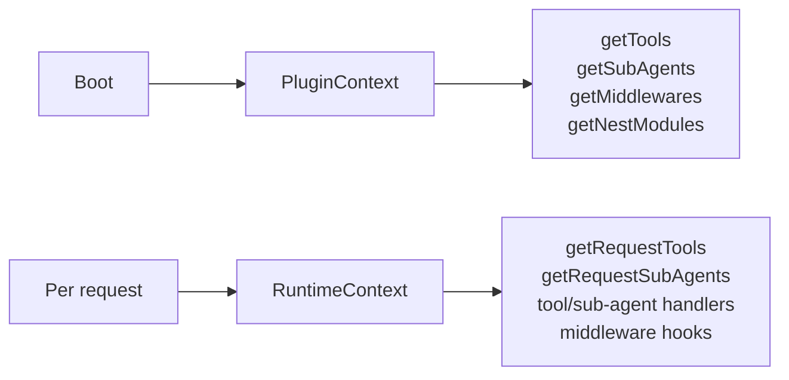

## Two contexts, two lifetimes

| Context | Lifetime | Has user? | Where you receive it |
| --- | --- | --- | --- |
| `PluginContext` | Boot (cached) | No | `getTools`, `getSubAgents`, `getMiddlewares`, `getNestModules` |
| `RuntimeContext` | Fresh per request | Yes (authenticated) | Tool handlers, sub-agent handlers, middleware hooks, `getRequestTools`, `getRequestSubAgents` |

The distinction matters because the wrong context can't see what your code needs. A boot-time hook can't ask "who is the user" — there is none yet. A per-request hook can't be used to register a Nest module — it's already too late.

## What each context carries

### `PluginContext` — boot-time, no user

- `config` — the merged, Zod-validated env (base + every plugin's `configSchema`).
- `identity` — your oracle's identity (`name`, `org`, `description`, `entityDid`, `prompt`).
- `availablePlugins` — set of names of all loaded plugins; useful for soft-dependency branching.
- `logger` — a plugin-scoped logger.

### `RuntimeContext` — per request, authenticated user

Everything in `PluginContext`, plus:

| Field | Purpose |
| --- | --- |
| `user` | DID, Matrix user ID, UCAN delegation, timezone |
| `session` | Thread ID (= `session.id`), client (`portal` / `matrix` / `slack`), request ID, room ID |
| `history` | `messages`, `recent(n)`, `userContext`, typed `state` view |
| `secrets` | `getIndex()`, `getValues(keys)` for per-user secrets |
| `blobStore` | Short-TTL keyed store for values the model must never echo verbatim (UCAN invocation CARs, JWTs): `put()` returns an opaque `blob_<hex>` id, `get()` resolves it server-side, `isValidBlobId()` checks the format. Blobs are scoped to the issuing user's DID |
| `matrix` | Scoped methods: `postToRoom`, `getRoomState`, `getEventById` |
| `ucan` | `requireCapability`, `hasCapability`, `mintInvocation`, `resolveServiceDid`, `hasSigningKey()`, `createInvocationFromDelegation()` |
| `llm` | `get(role, params)` for the configured provider — `role` is `'main'` / `'subagent'` / `'utility'` |
| `emit` | Typed event emitter (`toolCall`, `actionCall`, `renderComponent`, `reasoning`, ...) |
| `shared` | Typed reads from other plugins' `getSharedState` |
| `loadedPlugins` | Set of plugin names loaded for this thread |
| `toolCallId` | The current tool call's id — needed when a tool returns a LangGraph `Command` |
| `abortSignal` | Request-scoped abort |

Full field list and types: [RuntimeContext reference](/build-an-oracle/reference/runtime-context).

## Registration vs execution

A tool registered via boot-time `getTools(ctx)` still receives a fresh `RuntimeContext` when its handler fires. "Boot-time" applies to *when the tool is registered*, not to *when it runs*. Both contexts coexist over the lifetime of any tool.

## Choosing the right hook

If a hook exists in both forms, pick by what your code reads:

| If your code needs… | Use |
| --- | --- |
| Only config + identity | Boot-time hook (`getTools(ctx)`) |
| Live state (`loadedPlugins`, `userContext`, browser tools) | Per-request hook (`getRequestTools(rtCtx)`) |
| The authenticated user's DID / timezone at *registration* time | Per-request hook |
| Stable tool list | Boot-time hook |

When both hooks fire on the same plugin, their outputs are merged — no need to choose one or the other.

## Read next

<CardGroup cols={2}>
  <Card title="Write a plugin" icon="puzzle-piece" href="/build-an-oracle/develop/write-a-plugin">
    See both contexts in real code.
  </Card>
  <Card title="RuntimeContext reference" icon="table-list" href="/build-an-oracle/reference/runtime-context">
    The full field list.
  </Card>
</CardGroup>

Source: [`packages/oracle-runtime/src/runtime-context/`](https://github.com/ixoworld/ixo-oracles-boilerplate/blob/main/packages/oracle-runtime/src/runtime-context/) and [`PluginContext` / `RuntimeContext`](https://github.com/ixoworld/ixo-oracles-boilerplate/blob/main/packages/oracle-runtime/src/plugin-api/types.ts).
