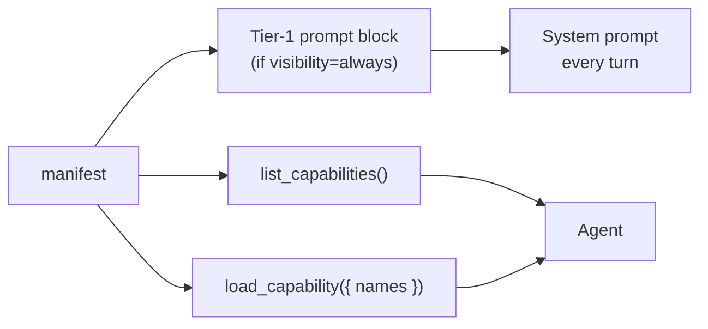

## What it is

Every plugin declares a `manifest` of type `PluginManifest`. It is not human documentation — it is structured metadata the LLM reads. The runtime uses it three ways:

1. The **Tier-1 prompt block** — the "Available Capabilities" list rendered for `always` plugins on every turn.
2. **`list_capabilities`** — the meta-tool the agent calls to enumerate what it can load.
3. **`load_capability`** — the meta-tool that returns a manifest in full when the agent activates a plugin mid-conversation.

## What each field is for

| Field | Purpose |
| --- | --- |
| `title` | Human-readable label. Distinct from `name` (kebab-case unique ID). |
| `summary` | One-line description. Heads each Tier-1 entry for `always` plugins as `- **{name}** — {summary}`. |
| `whenToUse` | Trigger phrases. The single most important field — quality here determines whether the LLM picks the plugin when it should. Required when `visibility !== 'silent'`. The first two render into Tier-1 as a `When to use:` sub-bullet. |
| `whenNotToUse` | Anti-pattern phrases. Use to disambiguate from overlapping plugins. The first renders into Tier-1 as an `Avoid for:` sub-bullet. |
| `examples` | Few-shot user-message → tool-call bindings. Cross-checked at boot — every example's `tool` must reference a tool this plugin registers. The first renders into Tier-1 as an `Example:` sub-bullet. |
| `tags` | Lowercase labels for search. |
| `category` | One of: `data`, `communication`, `automation`, `memory`, `integration`, `ui`, `auth`, `observability`, `core`. |
| `visibility` | `always` / `on-demand` / `silent`. See [Visibility tiers](/build-an-oracle/understand/visibility-tiers). |
| `stability` | `stable` / `beta` / `experimental`. Surfaced as a hint to the agent. |

Full schema table and validation rules live at [Manifest schema reference](/build-an-oracle/reference/manifest-schema).

## Where the agent sees it

Tier-1 plugins pay token cost on every turn forever — and not just the summary: each entry also renders `whenToUse`, `whenNotToUse`, and the first `example` as sub-bullets, so manifest length is prompt length. `on-demand` plugins cost nothing in the prompt until the agent loads them. `silent` plugins are never listed in Tier-1 and can't be loaded through the meta-tools (note: a silent plugin's tools, if it ships any, are still bound and callable — `silent` is not a security boundary).

## Writing a good manifest

- **Be specific in `whenToUse`.** "Weather questions" is too vague. "User asks about current weather, temperature, precipitation, or wind in any city" is precise.
- **Use `whenNotToUse` to disambiguate** when your plugin conceptually overlaps with another (Firecrawl vs Sandbox vs Domain Indexer is the canonical case).
- **Examples should cover the typical patterns**, not just the obvious one.
- **Keep `tags` lowercase.** They're for search ranking, not display.
- **Pick `visibility` deliberately.** Default to `on-demand`; promote to `always` only when the agent needs the plugin on nearly every turn.

<Tip>
The manifest is the part of your plugin the LLM reads most. Treat it like a system prompt: write it carefully, test it with real user messages, and iterate. A vague manifest is the most common reason a plugin doesn't fire when it should.
</Tip>

## Read next

<CardGroup cols={2}>
  <Card title="Write a plugin" icon="puzzle-piece" href="/build-an-oracle/develop/write-a-plugin">
    Where the manifest lives in code.
  </Card>
  <Card title="Manifest schema reference" icon="table-list" href="/build-an-oracle/reference/manifest-schema">
    Exact field types and constraints.
  </Card>
</CardGroup>

Source: [`PluginManifest`](https://github.com/ixoworld/ixo-oracles-boilerplate/blob/main/packages/oracle-runtime/src/plugin-api/types.ts).
