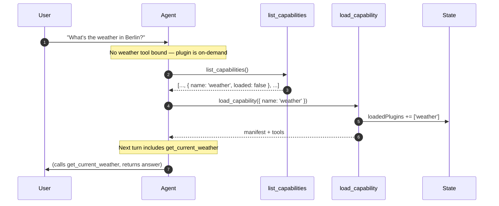

## Why meta-tools exist

A QiForge oracle can have dozens of plugins installed. Binding every one of them to the agent at boot would explode the prompt and the tool list. Instead, `on-demand` plugins are invisible at boot — the agent discovers them mid-conversation via two built-in meta-tools and loads what it needs for the current thread.

The runtime registers these tools itself. They are not authored by any plugin and cannot be overridden.

## The two tools

| Tool | Purpose |
| --- | --- |
| `list_capabilities` | Returns every visible plugin with its summary, visibility, loaded status, category, and tags. The agent uses this to scan what's available. |
| `load_capability` | Marks a plugin as loaded for the current thread, returns its full manifest plus tool descriptions, and appends a `ToolMessage` so the agent sees the manifest in conversation history on the same turn. |

`load_capability` errors when the named plugin doesn't exist, when it is `silent` (silent plugins are internal, not agent-loadable), and a no-op (returns `alreadyAvailable: true`) when the plugin is `always` or has already been loaded for this thread.

## The discovery loop



In practice the agent often skips `list_capabilities` and goes straight to `load_capability` when the user's intent maps obviously to a manifest the agent has seen recently. It falls back to listing when the intent is ambiguous.

## The `loadedPlugins` state field

The single new field added to the graph state. Per-thread, monotonically growing — `load_capability` only appends, never removes. The checkpointer persists it for free.

Loading a plugin in thread A does not affect thread B. Every new conversation rediscovers fresh.

## What the agent sees in the system prompt

For `always` plugins, the runtime renders a Tier-1 prompt block:

```text
## Available Capabilities

- memory: Durable memory across conversations...
- skills: Discover IXO skill capsules...
- domain-indexer: Domain analysis and entity lookup...
- sandbox: Per-user Linux box for code execution...
- user-preferences: ...

For more capabilities, call list_capabilities to discover what else
you can use, then load_capability to make tools available.
```

`on-demand` plugins are *not* listed here — the agent has to ask. `silent` plugins are never visible.

## Token cost

| Item | Cost per turn |
| --- | --- |
| Tier-1 prompt block | ~80 tokens per `always` plugin |
| Bound tool schemas | ~100–300 tokens per tool |
| Meta-tools themselves | ~100 tokens combined (negligible) |

For a fork with 50 `on-demand` plugins, the cost on a turn where none are loaded is the same as a fork with zero such plugins. That's the point.

## Read next

<CardGroup cols={2}>
  <Card title="Visibility tiers" icon="eye" href="/build-an-oracle/understand/visibility-tiers">
    The three modes and how to pick.
  </Card>
  <Card title="State schema" icon="table" href="/build-an-oracle/reference/state-schema">
    `loadedPlugins` and the rest of the graph state.
  </Card>
</CardGroup>

Source: [`packages/oracle-runtime/src/meta-tools/`](https://github.com/ixoworld/ixo-oracles-boilerplate/blob/main/packages/oracle-runtime/src/meta-tools/).
