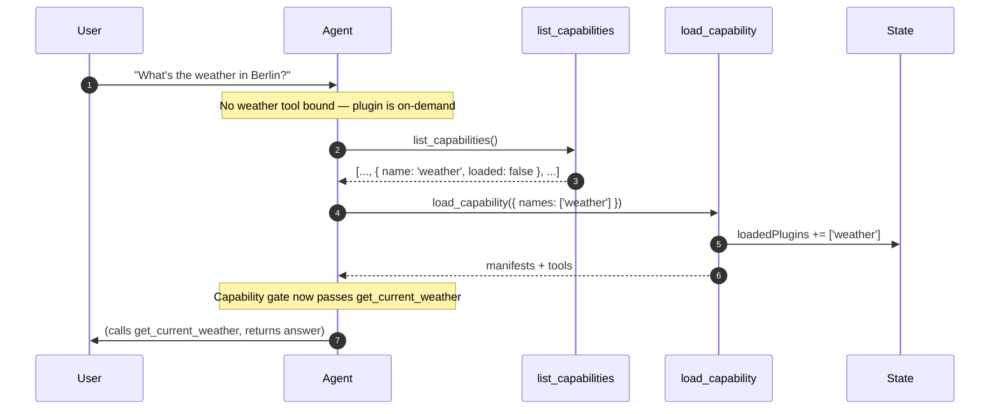

## Why meta-tools exist

A QiForge oracle can have dozens of plugins installed. Listing every one in the prompt would explode the system prompt and the tool list the model has to reason over. Instead, `on-demand` plugins are **not advertised** at boot — the agent discovers them mid-conversation via two built-in meta-tools and loads what it needs for the current thread.

Under the hood every tool is bound to the agent at compile time; a `CapabilityGateMiddleware` hides on-demand tools from the model until their plugin is loaded (see [How on-demand gating works](/build-an-oracle/understand/visibility-tiers#how-on-demand-gating-actually-works)). So "loading" lifts a per-turn filter — it does not bind new tools.

The runtime registers these meta-tools itself. They are not authored by any plugin and cannot be overridden.

## The two tools

| Tool | Purpose |
| --- | --- |
| `list_capabilities` | Returns every visible plugin with its summary, visibility, loaded status, category, and tags. The agent uses this to scan what's available. |
| `load_capability` | Takes `names: string[]` — an array, so the agent can load several capabilities in one call. Marks each plugin as loaded for the current thread, returns each one's full manifest plus tool descriptions, and appends a `ToolMessage` so the agent sees the manifests in conversation history on the same turn. |

`load_capability` accepts a batch and is processed per name: it throws when a named plugin doesn't exist, throws when one is `silent` (silent plugins are internal, not agent-loadable), and treats a name that is `always` or already loaded as a no-op (`alreadyAvailable: true`). Batching is preferred — the prompt instructs the agent to pass every capability it needs in a single `load_capability({ names: [...] })` call rather than making multiple calls in the same turn.

## The discovery loop



In practice the agent often skips `list_capabilities` and goes straight to `load_capability` when the user's intent maps obviously to a manifest the agent has seen recently. It falls back to listing when the intent is ambiguous.

## The `loadedPlugins` state field

The single new field added to the graph state. Per-thread, monotonically growing — `load_capability` only appends, never removes. The checkpointer persists it for free.

Loading a plugin in thread A does not affect thread B. Every new conversation rediscovers fresh.

## What the agent sees in the system prompt

For `always` plugins, the runtime renders a Tier-1 prompt block. Each entry is more than a one-liner — the plugin name and summary, then sub-bullets pulled straight from the manifest (`whenToUse`, `whenNotToUse`, and the first `example`):

```text
## Available Capabilities

- **memory** — Durable memory across conversations.
  - When to use: user refers to something from a past chat; you learn a durable fact
  - Avoid for: one-off lookups that don't need to persist
  - Example: "remember I prefer metric units" → save_memory({"text":"prefers metric"})
- **skills** — Discover and run IXO skill capsules.
  - When to use: a packaged skill could generate a file, report, or run a workflow
  - Example: "make me an invoice" → search_skills({"query":"invoice"})

For more capabilities, call `list_capabilities()` to see what else is available,
then `load_capability({ names: ["cap1", "cap2"] })` to make their tools available in one call.
```

Because `whenToUse`, `whenNotToUse`, and the first example all render into Tier-1, manifest quality directly drives prompt size. `on-demand` plugins are *not* listed here — the agent has to discover them. `silent` plugins are never listed and can't be loaded through the meta-tools.

## Token cost

| Item | Cost per turn |
| --- | --- |
| Tier-1 prompt block | ~80–150 tokens per `always` plugin (name + summary + whenToUse/avoid/example sub-bullets) |
| Bound tool schemas | ~100–300 tokens per tool |
| Meta-tools themselves | ~100 tokens combined (negligible) |

For a fork with 50 `on-demand` plugins, the cost on a turn where none are loaded is the same as a fork with zero such plugins. That's the point.

## Read next

<CardGroup cols={2}>
  <Card title="Visibility tiers" icon="eye" href="/build-an-oracle/understand/visibility-tiers">
    The three modes and how to pick.
  </Card>
  <Card title="State schema" icon="table" href="/build-an-oracle/reference/state-schema">
    `loadedPlugins` and the rest of the graph state.
  </Card>
</CardGroup>

Source: [`packages/oracle-runtime/src/meta-tools/`](https://github.com/ixoworld/ixo-oracles-boilerplate/blob/main/packages/oracle-runtime/src/meta-tools/).
