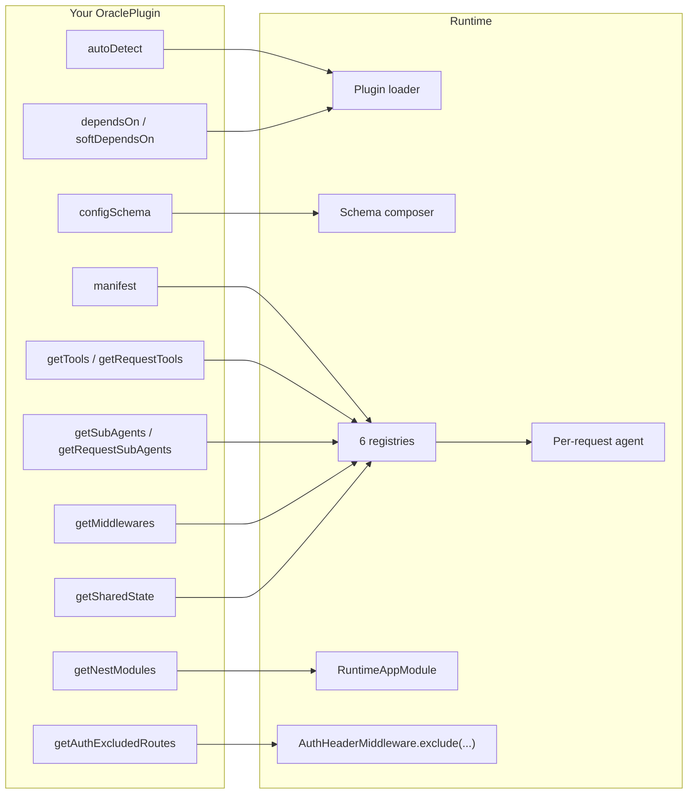

## Where each hook plugs in

The runtime never reaches inside your plugin. Every contribution flows through one of these channels.

## The ten contribution channels at a glance

The first four are **declarative properties** (data the runtime reads); the rest are **hooks** (methods the runtime calls).

| Channel | What it contributes | When called |
| --- | --- | --- |
| `manifest` | The agent-facing interface — title, summary, `whenToUse`, examples, visibility | Boot (validation + Tier-1 composition) |
| `configSchema` | A Zod object merged into the global env schema | Boot (env validation) |
| `dependsOn` / `softDependsOn` | Plugin ordering constraints | Boot (topo sort) |
| `autoDetect(env)` | Decide whether to load based on env | Boot (resolution) |
| `getTools(ctx)` / `getRequestTools(rtCtx)` | LLM-callable tools | Boot cache + per-request |
| `getSubAgents(ctx)` / `getRequestSubAgents(rtCtx)` | Focused inner agents (auto-wrapped as tools) | Boot cache + per-request |
| `getMiddlewares(ctx)` | LangChain `AgentMiddleware` objects (`beforeAgent` / `beforeModel` / `wrapModelCall` / `afterModel` / `wrapToolCall` / `afterAgent` hooks) | Boot cache |
| `getNestModules(ctx?)` | Nest modules (HTTP routes, services) | Boot, once |
| `getAuthExcludedRoutes()` | Routes that skip UCAN auth | Boot, once |
| `getSharedState()` | Read-only accessors other plugins can consume | Boot, once |

A middleware can declare any of the six LangChain hooks above. There is **no `onError` middleware hook** — to handle an LLM or tool error inside a middleware, wrap the call in `wrapModelCall` / `wrapToolCall` with `try`/`catch`.

Boot-time hooks (`getTools`, `getSubAgents`, `getMiddlewares`) are called once and the results are cached for every request. The per-request variants run on every agent build — use them only when the contribution depends on live state (e.g. `loadedPlugins`, current user, `rtCtx.shared.*`).

## Two contexts

| Context | Holds | Hooks that receive it |
| --- | --- | --- |
| `PluginContext` | `config`, `identity`, `availablePlugins`, `logger` | `getTools`, `getSubAgents`, `getMiddlewares`, `getNestModules` |
| `RuntimeContext` | Everything in `PluginContext` plus `user`, `session`, `history`, `secrets`, `matrix`, `ucan`, `llm`, `emit`, `shared`, `abortSignal`, `loadedPlugins` | `getRequestTools`, `getRequestSubAgents`, all handlers, all middleware hooks |

A tool registered via boot-time `getTools` still gets a fresh `RuntimeContext` when its handler fires. "Boot-time" refers to *registration*, not *execution*. See [Contexts](/build-an-oracle/understand/contexts) for the field list.

## Error semantics

| Hook throws… | Effect |
| --- | --- |
| `autoDetect`, manifest validation, `configSchema`, `getNestModules`, `getAuthExcludedRoutes`, `getSharedState` | Boot fails. Loud failures because misconfiguration in production is worse than no plugin. |
| `getTools` / `getSubAgents` / `getMiddlewares` (boot warm or per-request) | Logged with plugin name; plugin's contribution skipped for that build. Other plugins continue. |
| Tool / sub-agent `handler` | Becomes an error `ToolMessage` the agent sees; one retry on validation errors. |
| Middleware hook | Propagates as a turn error. |

## Read next

<CardGroup cols={2}>
  <Card title="Write a plugin" icon="puzzle-piece" href="/build-an-oracle/develop/write-a-plugin">
    Scaffold and ship one.
  </Card>
  <Card title="Manifest" icon="scroll" href="/build-an-oracle/understand/manifest">
    The agent-facing interface.
  </Card>
</CardGroup>

Source: [`packages/oracle-runtime/src/plugin-api/oracle-plugin.ts`](https://github.com/ixoworld/ixo-oracles-boilerplate/blob/main/packages/oracle-runtime/src/plugin-api/oracle-plugin.ts).
