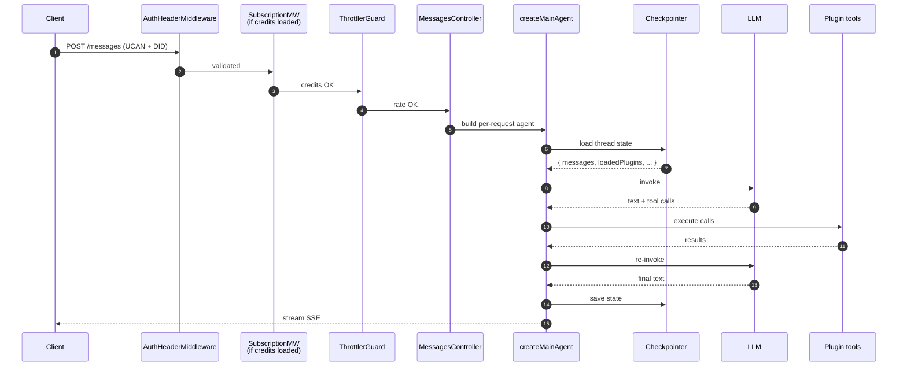

## The full path

## What each stop does

| Stop | Responsibility |
| --- | --- |
| **AuthHeaderMiddleware** | Validates the UCAN delegation (signature, expiry, audience, capability). Resolves the user's DID and attaches `RuntimeUserContext`. Failure → 401, agent never runs. |
| **SubscriptionMiddleware** | Only when the `credits` plugin is loaded. Checks user balance. Empty + `DISABLE_CREDITS !== 'true'` → 402. |
| **ThrottlerGuard** | Per-user rate limit, registered as a global Nest guard (`APP_GUARD`), not an HTTP middleware. Nest runs middleware before guards, so it still gates after auth and subscription. Breach → 429. |
| **MessagesController** | Reads the inbound message, looks up the session (creates on first contact), hands off to the agent builder. Returns SSE. |
| **createMainAgent** | Builds the per-request `RuntimeContext`, reads cached registries, runs `getRequestTools` / `getRequestSubAgents`, composes the prompt, returns a LangChain agent compiled against the per-user checkpointer. |
| **Checkpointer** | Loads `{ messages, loadedPlugins, userContext, ... }` for this `thread_id` (= session id) from per-user SQLite (synced to Matrix in the background). |
| **LLM invocation** | Composed prompt + bound tools + state messages go to the model resolved for the `main` role (provider from `LLM_PROVIDER`, or a `hooks.resolveModel` override). Plugin middleware fires (`beforeModel`, `wrapModelCall`, `afterModel`). |
| **Tool calls** | The agent loop dispatches plugin tools, sub-agent tools, meta-tools, and browser tools. Each emits a typed event so the client can render "Agent called X". |
| **Save state + stream** | The final state is checkpointed; the assistant message streams over SSE. WS events for intermediate steps have already shipped. |

## Where each plugin hook fires

| Hook | Fires during |
| --- | --- |
| `getTools`, `getSubAgents`, `getMiddlewares`, `getSharedState` | Read from boot cache during agent build |
| `getRequestTools`, `getRequestSubAgents` | Per-request agent build |
| `middlewares[].beforeModel` / `wrapModelCall` / `afterModel` | Around each LLM invocation |
| `middlewares[].wrapToolCall` | Around each tool call |
| Tool / sub-agent `handler` | When the LLM calls the tool |
| `getNestModules` controllers | Any HTTP request to a plugin route |

## Failure modes

| What fails | Effect |
| --- | --- |
| UCAN validation | 401. Agent never runs. |
| Credit check | 402. Agent never runs. |
| Rate limit | 429. Agent never runs. |
| Checkpointer load | Error logged; falls back to empty state. Turn proceeds. |
| LLM | Propagates to the client by default. A middleware can catch it by wrapping the call in `wrapModelCall` with `try`/`catch`. |
| Tool handler | One retry on validation error; otherwise the error becomes a `ToolMessage` the agent sees. |
| Sub-agent init | `Promise.allSettled` — log and skip; rest of turn continues. |

## Read next

<CardGroup cols={2}>
  <Card title="Contexts" icon="layer-group" href="/build-an-oracle/understand/contexts">
    What `RuntimeContext` carries.
  </Card>
  <Card title="Meta-tools" icon="magnifying-glass" href="/build-an-oracle/understand/meta-tools-and-loading">
    How `load_capability` mutates `loadedPlugins` mid-turn.
  </Card>
</CardGroup>

Source: [`packages/oracle-runtime/src/graph/`](https://github.com/ixoworld/ixo-oracles-boilerplate/blob/main/packages/oracle-runtime/src/graph/) and [`packages/oracle-runtime/src/modules/messages/`](https://github.com/ixoworld/ixo-oracles-boilerplate/blob/main/packages/oracle-runtime/src/modules/messages/).
