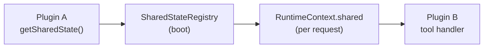

## What it is

Shared state is a typed, read-only channel one plugin uses to expose a derived value to other plugins. A producer plugin declares an accessor; consumer plugins read it through `RuntimeContext.shared`.

It is the only sanctioned way for two plugins to share live data. Plugins do not import each other's classes or call each other's services.

## When to use it

| Good fit | Bad fit |
| --- | --- |
| A derived value other plugins might want (e.g. `userProfile`, `lastWeatherQuery`, `activePageId`) | Mutable state with multiple writers |
| Cheap reads that abstract graph-state field names | Large blobs consumers might read but ignore |
| Stable shape worth declaring on `SharedAccessors` for typed reads | Plugin internals other plugins shouldn't see |

If only your plugin reads it, keep it private.

## The contract

- **Read-only.** Consumers never mutate the value. Producers update their own internal state via tool handlers or middlewares; the accessor just exposes a view.
- **Flat namespace.** Keys live in a single global record. Two plugins registering the same key fail boot — no quiet overrides.
- **Lazy.** Each accessor is a function `(state, runCtx) => value`. It runs every time a consumer reads. Cheap reads only; cache in the producer if derivation is expensive.
- **Optional.** A consumer must assume the producer may not be installed. `rtCtx.shared.someKey` can be `undefined`. Pair shared state with `softDependsOn` so the soft dependency is explicit in `qiforge inspect`.

## Typed reads

`SharedAccessors` is an open interface. Producer plugins extend it via TypeScript declaration merging so consumers see the right type on `rtCtx.shared.someKey`. Without merging, the key types as `unknown` and consumers cast.

Use declaration merging when the shape is stable; skip it for ad-hoc keys.

## Read next

<CardGroup cols={2}>
  <Card title="Share state (recipe)" icon="share-nodes" href="/build-an-oracle/develop/plugin-recipes/share-state">
    Producer and consumer code, declaration merging, the collision check.
  </Card>
  <Card title="Declare dependencies" icon="link" href="/build-an-oracle/develop/plugin-recipes/declare-dependencies">
    Pair shared state with `softDependsOn`.
  </Card>
</CardGroup>

Source: [`SharedAccessors`](https://github.com/ixoworld/ixo-oracles-boilerplate/blob/main/packages/oracle-runtime/src/plugin-api/types.ts).
