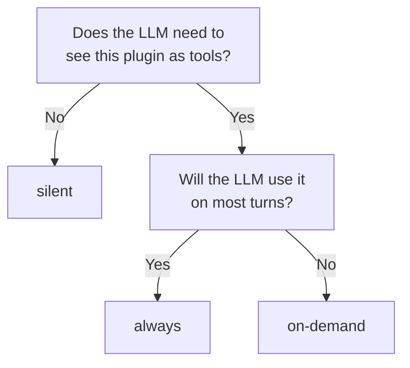

## The three tiers

| Visibility | Tools bound at boot? | Listed in Tier-1 prompt? | Discoverable via `list_capabilities` / `load_capability`? |
| --- | --- | --- | --- |
| `always` | Yes | Yes | Yes |
| `on-demand` | No — until `load_capability(name)` | No | Yes |
| `silent` | Yes (but invisible to the LLM as tools) | No | No |

**Default: `on-demand`.** A plugin without an explicit `visibility` is treated as `on-demand`.

## What each tier is for

| Tier | Use for | Token cost per turn |
| --- | --- | --- |
| `always` | Plugins the agent needs on nearly every turn (e.g. `memory`, `skills`, `user-preferences`) | ~80 tokens for the Tier-1 entry + tool schemas (~100–300 per tool) on every turn |
| `on-demand` | Plugins useful in narrow situations (e.g. `portal`, `firecrawl`, `composio`) | Zero until loaded; same as `always` after |
| `silent` | Plugins that act through middlewares or HTTP only (e.g. `credits`, `slack`) | Zero in the prompt; middlewares still run |

## Picking a tier

Promoting to `always` is a deliberate budget choice. Demoting to `silent` is a deliberate architectural choice. Most plugins should stay on the default — `on-demand`.

<Tip>
A fork with 50 plugins, all `on-demand`, can typically keep 3–5 loaded per thread. The agent learns to discover via `list_capabilities` and load via `load_capability`. Token cost stays bounded; the catalog can grow.
</Tip>

## Loading and unloading

`on-demand` plugins live in a per-thread `loadedPlugins` state field. The set is monotonic — it only grows. Loading a plugin makes its tools available for the rest of that thread; a new thread starts with an empty `loadedPlugins`.

There is no "unload" operation. If a thread accumulates too many loaded plugins, starting a new thread is the reset.

## Per-tool override

A plugin can override visibility per tool by setting `visibility` on the `PluginTool` itself. This lets one plugin ship a mix — e.g. one `always` tool and several `on-demand` tools — without splitting into two plugins.

## Read next

<CardGroup cols={2}>
  <Card title="Set visibility (recipe)" icon="eye" href="/build-an-oracle/build/plugin-recipes/set-visibility">
    How to declare each tier in plugin code.
  </Card>
  <Card title="Meta-tools" icon="magnifying-glass" href="/build-an-oracle/understand/meta-tools-and-loading">
    How `list_capabilities` and `load_capability` work.
  </Card>
</CardGroup>

Source: [`PluginManifest`](https://github.com/ixoworld/ixo-oracles-boilerplate/blob/main/packages/oracle-runtime/src/plugin-api/types.ts).
