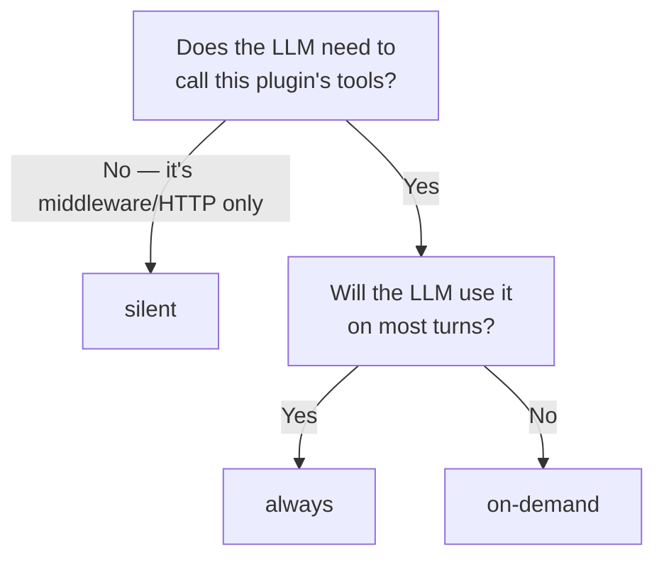

## All tools are bound; visibility controls exposure

A common misconception: that `visibility` decides whether a plugin's tools are *bound* to the agent. It doesn't. **Every plugin tool — `always`, `on-demand`, and `silent` — is bound to the agent at compile time.** What `visibility` controls is three separate things: whether the plugin is **advertised** in the Tier-1 prompt block, whether it is **discoverable** via the meta-tools, and whether the LLM can **call** its tools right now (the [CapabilityGate](#how-on-demand-gating-actually-works) enforces this last one per model call).

## The three tiers

| Visibility | Callable by the LLM | Listed in Tier-1 prompt | Discoverable via `list_capabilities` / `load_capability` |
| --- | --- | --- | --- |
| `always` | Always | Yes | Yes |
| `on-demand` | After `load_capability({ names: [...] })` for this thread | No | Yes |
| `silent` | Always (if it ships tools) | No | No |

**Default: `on-demand`.** A plugin without an explicit `visibility` is treated as `on-demand`.

<Warning>
`silent` does **not** hide a tool from the model. A silent tool passes the CapabilityGate exactly like an `always` tool — it is bound and the LLM can call it on any turn. `silent` only means "not advertised in Tier-1 and not loadable via the meta-tools." In practice silent plugins contribute middleware or HTTP routes rather than LLM tools. Do not use `silent` as a security boundary — it is not one.
</Warning>

## What each tier is for

| Tier | Use for | Token cost per turn |
| --- | --- | --- |
| `always` | Plugins the agent needs on nearly every turn (e.g. `memory`, `skills`, `user-preferences`) | ~80–150 tokens for the Tier-1 entry + tool schemas (~100–300 per tool) on every turn |
| `on-demand` | Plugins useful in narrow situations (e.g. `portal`, `firecrawl`, `composio`) | No Tier-1 entry; tool schemas only count once the plugin is loaded |
| `silent` | Plugins that act through middleware or HTTP only (e.g. `credits`, `calls`) | No Tier-1 entry and not discoverable; any tools it ships are still bound |

## How on-demand gating actually works

Because all tools are bound at compile time, "loading" a plugin is **not** about binding — it's about lifting a filter. The `CapabilityGateMiddleware` runs on every model call. It reads the thread's `loadedPlugins` set and trims the tool list the model sees:

- `always` and `silent` tools → always pass the gate (the model can call them).
- `on-demand` tools → pass only when their plugin is in `loadedPlugins`.

`createAgent({ tools })` freezes the bound list, so a `load_capability` call updating state mid-run would otherwise have no effect until the next request rebuilt the agent. Filtering inside the middleware lets a load decision take effect on the very next LLM call. The gate is one of the [always-on middlewares](/build-an-oracle/understand/architecture).

## Picking a tier

Promoting to `always` is a deliberate budget choice — it pays Tier-1 tokens on every turn. `silent` is for plugins that don't need to be advertised or discovered (they work through middleware or HTTP). Most plugins should stay on the default — `on-demand`.

<Tip>
A fork with 50 plugins, all `on-demand`, can typically keep 3–5 loaded per thread. The agent learns to discover via `list_capabilities` and load via `load_capability`. Token cost stays bounded; the catalog can grow.
</Tip>

## Loading and unloading

`on-demand` plugins live in a per-thread `loadedPlugins` state field. The set is monotonic — it only grows. Loading a plugin makes its tools available for the rest of that thread; a new thread starts with an empty `loadedPlugins`.

There is no "unload" operation. If a thread accumulates too many loaded plugins, starting a new thread is the reset.

## Per-tool override

A plugin can override visibility per tool by setting `visibility` on the `PluginTool` itself. This lets one plugin ship a mix — e.g. one `always` tool and several `on-demand` tools — without splitting into two plugins.

## Read next

<CardGroup cols={2}>
  <Card title="Set visibility (recipe)" icon="eye" href="/build-an-oracle/develop/plugin-recipes/set-visibility">
    How to declare each tier in plugin code.
  </Card>
  <Card title="Meta-tools" icon="magnifying-glass" href="/build-an-oracle/understand/meta-tools-and-loading">
    How `list_capabilities` and `load_capability` work.
  </Card>
</CardGroup>

Source: [`PluginManifest`](https://github.com/ixoworld/ixo-oracles-boilerplate/blob/main/packages/oracle-runtime/src/plugin-api/types.ts).
