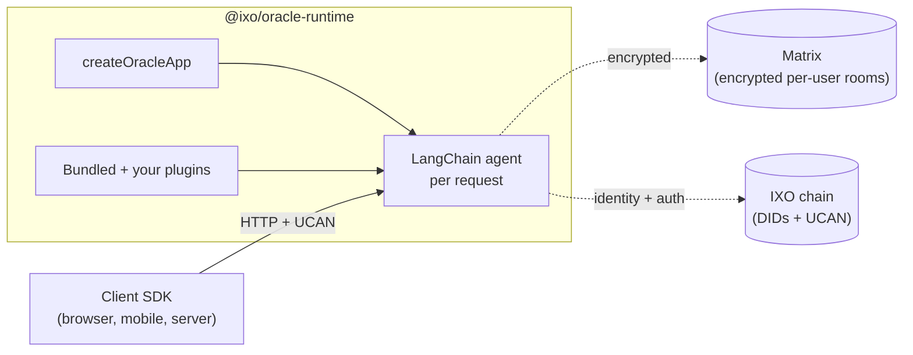

## The one-pager

An **Agentic Oracle** is an AI agent that owns a verifiable identity on IXO, talks to users through encrypted per-user Matrix rooms, authenticates every request via UCAN delegation, and composes its capabilities from plugins (compiled in) and skills (discovered at runtime).

**QiForge is the framework that lets you ship one.** The runtime (`@ixo/oracle-runtime`) handles bootstrap, auth, the agent loop, the checkpointer, Matrix wiring, and 16 bundled plugins. Your oracle is a thin `main.ts` plus whatever custom plugins you write.

## Three layers, one diagram

You write the green box (and any custom plugins). Everything else is shipped in the framework.

## Plugin vs skill — the most important distinction

| | **Plugin** | **Skill** |
| --- | --- | --- |
| **What it is** | TypeScript extension to the runtime | Executable capsule from the IXO skills registry |
| **Where it lives** | Inside your oracle's bundle | Remote, fetched at request time |
| **When it loads** | At boot, via `createOracleApp` | Per request, when the agent decides to use one |
| **Who authors it** | Oracle developer (you, or the framework team for bundled) | Anyone — published to the public registry |
| **How the agent uses it** | Tools bound directly to the LLM | The agent calls `search_skills` + `sandbox_run` (plugin tools) to find and execute one |

Use a plugin when only your team needs to extend the oracle and you want type safety + full host access. Use a skill when the community should be able to publish capabilities without touching your code.

[Read the full Plugin vs Skill comparison](/build-an-oracle/understand/plugins-vs-skills)

## What you can build

- **Domain agents** — climate, MRV, carbon DAO assistants.
- **Workflow copilots** — drive an AG-UI portal, fill forms, navigate browsers.
- **Integration hubs** — Gmail, GitHub, Linear, Slack, Notion via the bundled `composio` plugin.
- **Skill runners** — discover and run community-authored capsules in a per-user Linux sandbox.

## Where to go next

<CardGroup cols={2}>
  <Card title="Architecture" icon="diagram-project" href="/build-an-oracle/understand/architecture">
    The three layers, bootstrap flow, and what's pluggable vs fixed.
  </Card>
  <Card title="Quickstart" icon="play" href="/build-an-oracle/quickstart">
    Build a working oracle in 10 minutes with the CLI.
  </Card>
</CardGroup>

Source: [`createOracleApp`](https://github.com/ixoworld/ixo-oracles-boilerplate/blob/main/packages/oracle-runtime/src/bootstrap/create-oracle-app.ts).
