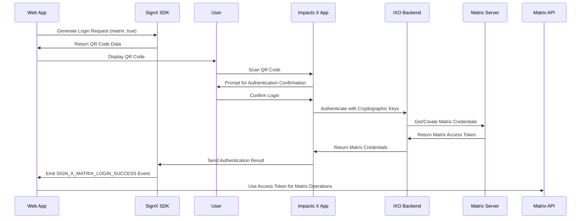

<Tip>
  The IXO Spatial Web uses both industry-standard authentication mechanisms and decentralized identity systems to ensure secure access to APIs and services.
</Tip>

## Authentication Methods

<AccordionGroup>
  <Accordion title="Bearer Token Authentication" icon="key">
    ```bash
    Authorization: Bearer <your_token>
    ```
    The primary authentication method using secure tokens:
    - JWT-based access tokens
    - Short-lived token expiry
    - Refresh token support
    - Role-based permissions
  </Accordion>

  <Accordion title="DID Authentication" icon="fingerprint">
    ```json
    {
      "did": "did:ixo:entity:<did-string>",
      "signature": "<signed-challenge>",
      "challenge": "<challenge-string>"
    }
    ```
    Decentralized identity authentication for:
    - Oracle services
    - Impact claims
    - Verifiable credentials
    - Domain operations
  </Accordion>

  <Accordion title="API Key Authentication" icon="key-skeleton">
    ```bash
    X-API-Key: <your_api_key>
    ```
    Simplified authentication for:
    - Development environments
    - Limited-access endpoints
    - Service-to-service calls
    - Testing and integration
  </Accordion>

  <Accordion title="SignX Authentication" icon="mobile">
    ```json
    {
      "matrix": true,
      "session_id": "<unique_session_id>",
      "login_token": "<one_time_token>"
    }
    ```
    Mobile-to-web authentication using IXO Impacts X:
    - QR code or deep link initiation
    - Cryptographic key-based authentication
    - No password entry required
    - Matrix credentials retrieval
    - Secure device-based identity verification
  </Accordion>
</AccordionGroup>

## Security Requirements

<CardGroup>
  <Card title="HTTPS Only" icon="lock">
    - TLS 1.2+ required
    - Certificate validation
    - Secure cipher suites
    - HSTS enabled
  </Card>

  <Card title="Token Management" icon="key">
    - Secure storage
    - Regular rotation
    - Expiry handling
    - Revocation support
  </Card>

  <Card title="Access Control" icon="shield-check">
    - Role-based access
    - Scope limitations
    - Resource permissions
    - Audit logging
  </Card>

  <Card title="Rate Limiting" icon="gauge">
    - Request quotas
    - Burst handling
    - IP restrictions
    - Usage monitoring
  </Card>
</CardGroup>

## Implementation Guide

<Steps>
  1. **Choose Authentication Method**
     - Bearer token for web applications
     - DID auth for blockchain operations
     - API keys for development
     - SignX for mobile-to-web authentication

  2. **Configure Security Settings**
     - Enable HTTPS
     - Set token expiry
     - Configure rate limits
     - Enable monitoring

  3. **Implement Authentication Flow**
     - Handle token requests
     - Validate credentials
     - Manage sessions
     - Process renewals

  4. **Set Up Error Handling**
     - Invalid credentials
     - Expired tokens
     - Rate limit exceeded
     - Network issues
</Steps>

## OAuth 2.0 Integration

<AccordionGroup>
  <Accordion title="Authorization Code Flow" icon="arrow-right-to-bracket">
    ```mermaid
    sequenceDiagram
      Client->>Auth Server: Authorization Request
      Auth Server->>User: Authentication Prompt
      User->>Auth Server: Credentials
      Auth Server->>Client: Authorization Code
      Client->>Auth Server: Token Request
      Auth Server->>Client: Access Token
    ```
    Best for web applications with user interaction
  </Accordion>

  <Accordion title="Client Credentials Flow" icon="server">
    ```mermaid
    sequenceDiagram
      Client->>Auth Server: Client Credentials
      Auth Server->>Client: Access Token
      Client->>Resource: API Request
      Resource->>Client: Protected Resource
    ```
    Ideal for service-to-service authentication
  </Accordion>
</AccordionGroup>

## Best Practices

<AccordionGroup>
  <Accordion title="Token Security" icon="shield">
    - Store tokens securely
    - Use short expiration times
    - Implement refresh flows
    - Handle revocation
  </Accordion>

  <Accordion title="Error Handling" icon="triangle-exclamation">
    - Proper error responses
    - Retry mechanisms
    - Rate limit handling
    - Logging and monitoring
  </Accordion>

  <Accordion title="DID Authentication" icon="fingerprint">
    - Verify DID ownership
    - Check signature validity
    - Validate challenge
    - Monitor DID status
  </Accordion>

  <Accordion title="SignX Authentication" icon="mobile">
    - Generate secure one-time QR codes
    - Implement event listeners for login events
    - Securely store received Matrix credentials
    - Handle session expiration gracefully
    - Consider auto-provisioning Matrix accounts
  </Accordion>
</AccordionGroup>

## Code Examples

<CodeGroup>
  ```typescript Bearer Token
  const headers = {
    'Authorization': `Bearer ${accessToken}`,
    'Content-Type': 'application/json'
  };

  const response = await fetch('https://api.emerging.eco/v1/resource', {
    headers
  });
  ```

  ```typescript DID Auth
  const challenge = await requestChallenge(did);
  const signature = await signChallenge(challenge, privateKey);

  const auth = {
    did,
    challenge,
    signature
  };

  const response = await authenticate(auth);
  ```

  ```typescript API Key
  const headers = {
    'X-API-Key': apiKey,
    'Content-Type': 'application/json'
  };

  const response = await fetch('https://api.emerging.eco/v1/resource', {
    headers
  });
  ```

  ```typescript SignX Authentication
  // Web application side
  import { SignXClient } from '@ixo/sign-x-sdk';

  // Initialize SignX client
  const signXClient = new SignXClient({
    appId: 'your-app-id',
    redirectUrl: 'https://your-app.com/callback'
  });

  // Generate login request with Matrix option enabled
  const loginRequest = await signXClient.generateLoginRequest({
    matrix: true,
    sessionId: uniqueSessionId
  });

  // Display QR code with loginRequest.qrCodeData
  displayQRCode(loginRequest.qrCodeData);

  // Listen for authentication events
  signXClient.on('SIGN_X_MATRIX_LOGIN_SUCCESS', (event) => {
    const { accessToken, userId, deviceId } = event;
    
    // Store Matrix credentials securely
    sessionStorage.setItem('matrixAccessToken', accessToken);
    
    // Initialize Matrix client with retrieved credentials
    const matrixClient = createMatrixApiClient({
      homeServerUrl: 'https://matrix.emerging.eco',
      accessToken
    });
    
    // Proceed with authenticated Matrix operations
  });
  ```
</CodeGroup>

## SignX Authentication Flow



## Developer Resources

<CardGroup>
  <Card title="API Reference" icon="book" href="/api-docs/authentication">
    Detailed API authentication docs
  </Card>
  
  <Card title="SDK Guide" icon="code" href="/spatial-web-stack/sdks/ixo-multiclient-sdk">
    Client library integration
  </Card>
  
  <Card title="Security Guide" icon="shield-check" href="/guides/dev/domain-privacy">
    Security best practices
  </Card>
  
  <Card title="Examples" icon="lightbulb" href="/guides/hands-on">
    Implementation examples
  </Card>
  
  <Card title="SignX SDK" icon="mobile-screen" href="/spatial-web-stack/sdks/sign-x-sdk">
    Mobile authentication integration
  </Card>
</CardGroup>