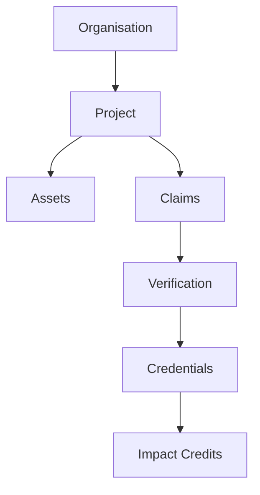

<Tip>
  Cognitive Digital Twins (CDTs) provide digital representations of the energy system, including physical devices, households, and processes. This enables real-time monitoring, automated verification, and AI-driven optimization of household energy transition and related climate impact mitigation activities.
</Tip>

## Why Cognitive Digital Twins (CDTs)?

<CardGroup>
  <Card title="Real-Time Intelligence" icon="brain">
    AI-powered monitoring and decision making
  </Card>
  <Card title="Automated Verification" icon="check-double">
    Self-verifying claims and outcomes
  </Card>
  <Card title="Smart Coordination" icon="webhook">
    Orchestrate complex multi-stakeholder systems
  </Card>
  <Card title="Data Sovereignty" icon="shield">
    Privacy-preserving data and identity management
  </Card>
</CardGroup>

## CDT System Architecture
A highly simplified graph representation of the CDT system architecture for a household energy system.

## Core CDT Components

### Digital Entities
<CardGroup>
  <Card title="Physical Devices" icon="microchip">
    Smart stoves, meters, and sensors
  </Card>
  <Card title="Households" icon="house">
    Beneficiary profiles and usage data
  </Card>
  <Card title="Organisations" icon="building">
    Project implementers and verifiers
  </Card>
  <Card title="Digital Assets" icon="coins">
    Carbon credits and impact tokens
  </Card>
</CardGroup>

### Identity Framework

<AccordionGroup>
  <Accordion title="Decentralized Identifiers (DIDs)">
    - W3C standard identifiers
    - Cryptographically verifiable
    - Self-sovereign control
    - Resolvable metadata
  </Accordion>

  <Accordion title="Verifiable Credentials">
    - Device registration
    - Household enrollment
    - Impact claims
    - Carbon credits
  </Accordion>

  <Accordion title="Authorization Rights">
    - Role-based access control
    - Delegated permissions
    - Multi-signature governance
    - Revocation management
  </Accordion>
</AccordionGroup>

## Domain Properties

<AccordionGroup>
  <Accordion title="Entity Configuration">
    - Unique identifiers (DIDs)
    - Controller assignments
    - Service endpoints
    - Resource links
  </Accordion>

  <Accordion title="Data Management">
    - Usage metrics
    - Performance data
    - Environmental impact
    - Financial transactions
  </Accordion>

  <Accordion title="Relationship Mapping">
    - Project hierarchies
    - Stakeholder roles
    - Asset ownership
    - Claim verification flows
  </Accordion>

  <Accordion title="Governance Rules">
    - Access permissions
    - Verification requirements
    - Update protocols
    - Compliance checks
  </Accordion>
</AccordionGroup>

## Advanced Capabilities

### Intelligent Automation
<CardGroup>
  <Card title="Smart Monitoring" icon="gauge">
    Real-time performance tracking and alerts
  </Card>
  <Card title="Predictive Analytics" icon="chart-line">
    Usage patterns and maintenance forecasting
  </Card>
  <Card title="Claims Processing" icon="gears">
    Digital MRV and payment processing
  </Card>
  <Card title="Asset Generation" icon="diamond">
    Digitally certified impact credits
  </Card>
</CardGroup>

### CDT System Integrations
<CardGroup>
  <Card title="IoT Connectivity" icon="wifi" href="/spatial-web-stack/spatial-web-sdks">
    Device data streaming and control
  </Card>
  <Card title="Registry Services" icon="grid" href="/platforms/Emerging/registry">
    Asset and claim registration
  </Card>
  <Card title="Payment Systems" icon="credit-card" href="/platforms/Emerging/payment-integration">
    Digital payments and tokenization
  </Card>
  <Card title="Impact Markets" icon="globe" href="/platforms/Emerging/carbon-credits">
    Carbon credit trading & ITMO purchases
  </Card>
</CardGroup>

## Implementation Guide

1. [Set up your development environment](/guides/dev/introduction)
2. [Create digital twins](/guides/digital-twins) for your devices and entities
3. [Configure monitoring](/platforms/Emerging/household-monitoring) and verification rules
4. [Implement dMRV](/platforms/Emerging/emerging-dmrv) for impact tracking
5. [Enable payments](/platforms/Emerging/payment-integration) and tokenization

## Developer Resources

<CardGroup>
  <Card title="API Documentation" icon="code" href="/api-docs/emerging-api/emerging-api">
    Complete API reference
  </Card>
  <Card title="SDKs" icon="box" href="/spatial-web-stack/spatial-web-sdks">
    Development tools and libraries
  </Card>
  <Card title="AI Companion" icon="sparkles" href="assistant.ixo.world">
    AI-powered developer co-pilot
  </Card>
  <Card title="Support" icon="headset" href="https://ixofoundation.slack.com/archives/C04UERAUHQT">
    Developer community
  </Card>
</CardGroup>
